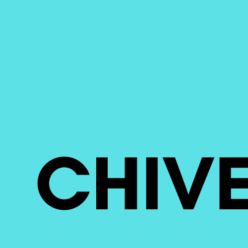

# Chive Programming Language
 
The chive programming language is a write once, run anywhere programming language in a bite sized package. It has syntax similar to BASIC which means that anyone can learn chive easily. Not only that but chive is really small. Its web release is only 6kb!!!

As of the current moment chive is under minimal development. I started working on it as a small project but it reached way more people then I thought that it would. I am working on a c++ interpreter smaller then 10kb. In the long term chive will be a smaller and faster alternative to Lua with a basic syntax for anyone to understand.
 
## Usage
To use chive you need to make a main.ch file and a include.ch file. The main.ch file will include all of your code while the include.ch file will point to the library that you will be using. To use chive on the web you will need to create a index.html file that points to your code and chive.js. Take a look at web examples.

To use chive on windows move the chive.exe file to the location of your main.ch code and run it. You can use the packager.exe(deprecated) to make an executable or web build of your chive app. The packager is still in production and is frankly un-needed. You can look at the docs when they are finished.

## Syntax
Like I said earlier the syntax is just like BASIC but **easier**. Everything is done by simple commands which simplify's software development. Here is an example of a simple calculator made with chive(Note that spaces are not needed before functions):

    label start;
        set number1 0;
        set number2 0;
        input number1 "Number 1:";
        input number2 "Number 2:";
        convint number1;convint number2;
        print number1 + number2;
    label end;
Or a simple fibonacci program:

    label start;
        set number 0;
        input number "Enter the number of terms: ";
        convint number;
        if number==0 goto end;
            set n1 0;set n2 1;set nextTerm 0;
            print "Fibonacci Series:";
            set i 1;
            while i<=number;
                print n1;
                set nextTerm n1 + n2;
                set n1 n2;
                set n2 nextTerm;
                set i i+1;
            end;
        label end;

## Building

See the documentation for building the python or c++ source code. The javascript source code doesn't need to be built but it is advised to minify the code.
## To-Do

 - [In Progress] Finish C++ Intepreter
 - [In Progress] Add Documentation
 - [In Progress ] Make Universal IO and Graphics Library
 - [In Progress] Remake Doom in Chive

